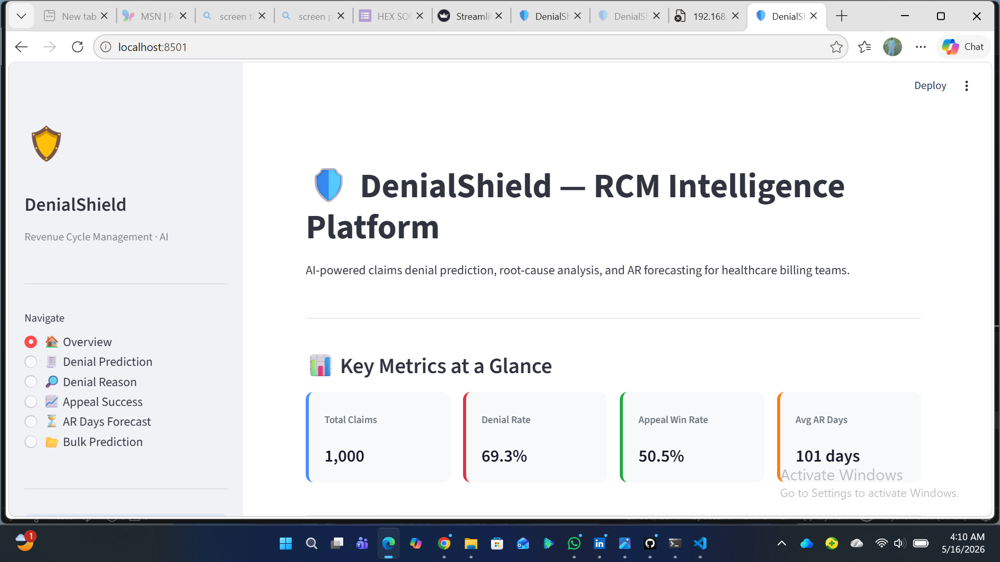
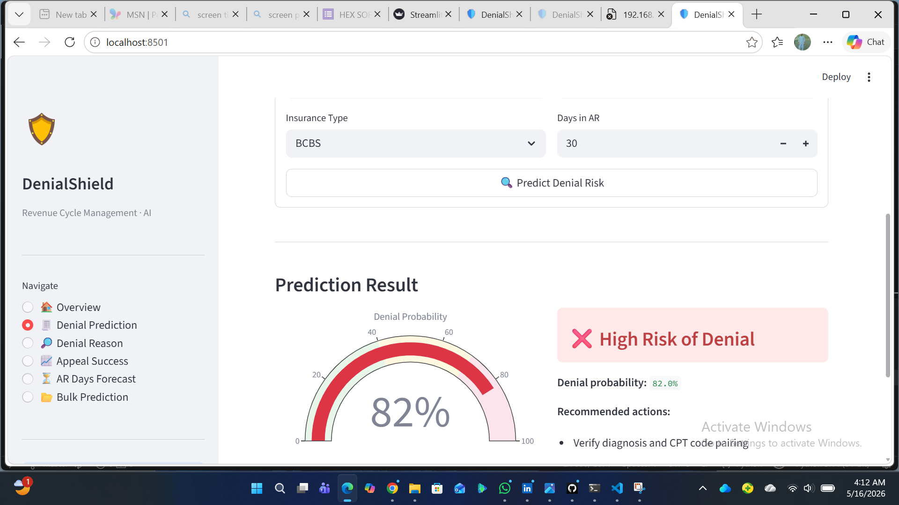
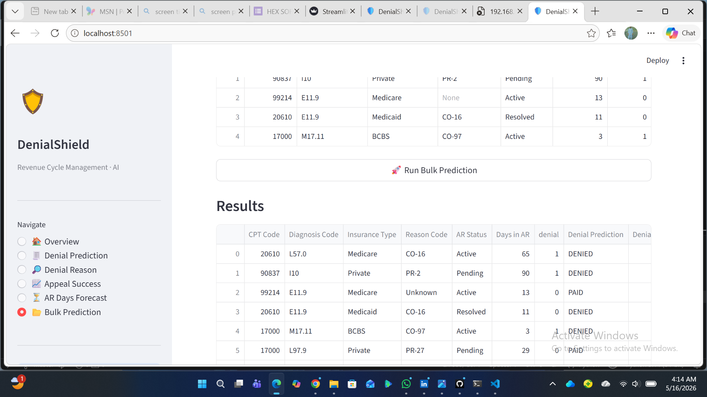
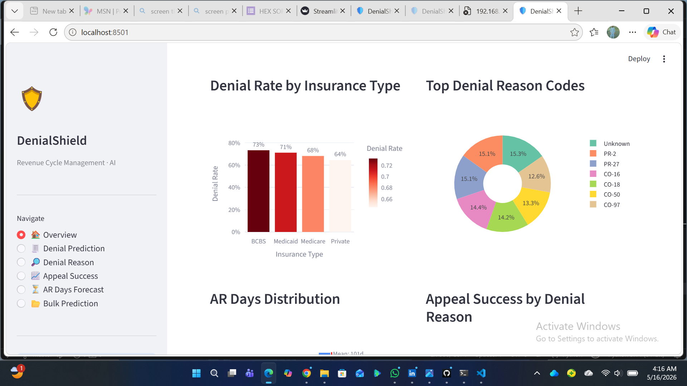

# 🛡️ DenialShield — RCM Intelligence Platform

> AI-powered Revenue Cycle Management platform for healthcare billing teams. Predict claim denials, classify denial reasons, forecast AR days, and estimate appeal success — all in one deployed application.


---

## 📸 Screenshots

### 🏠 Overview Dashboard

> Key metrics at a glance — Total Claims, Denial Rate, Appeal Win Rate, and Average AR Days

### 🔮 Single Claim Prediction

> Enter claim details manually and get instant denial risk prediction with probability gauge and recommended actions

### 📁 Bulk Prediction

> Upload a CSV file and get predictions for all claims at once with a downloadable results table

### 📊 Analytics & Visualizations

> Denial rate by insurance type, top denial reason codes, AR days distribution, and appeal success analysis

---

## 📌 Overview

**DenialShield** is a full end-to-end machine learning application built for the **healthcare billing domain**. It helps hospitals and billing teams:

- 🚫 Prevent claim denials **before submission**
- 🔍 Identify **root causes** of denied claims
- 📅 Forecast **AR days** to optimize cash flow
- ⚖️ Estimate **appeal success** probability

---

## 🤖 ML Models

| Model | Type | Purpose |
|-------|------|---------|
| **Denial Prediction** | Random Forest Classifier | Predicts if a claim will be denied before submission |
| **Denial Reason** | Random Forest Classifier | Identifies root cause of claim denials |
| **Appeal Success** | Random Forest Classifier | Predicts likelihood of winning an appeal |
| **AR Days Forecast** | Random Forest Regressor | Forecasts accounts receivable days |

---

## ✨ Features

- 🏠 **Overview Dashboard** — key metrics, denial rates, AR trends at a glance
- 🔮 **Single Prediction** — manually enter claim details, get instant prediction with probability gauge
- 📁 **Bulk Prediction** — upload CSV, get predictions for all claims at once
- 📊 **Interactive Charts** — denial rate by insurance type, top denial reason codes, AR distribution
- ⚡ **Recommended Actions** — actionable suggestions based on prediction results
- 📥 **Download Results** — export bulk prediction results as CSV

---

## 🧭 Navigation

| Page | Description |
|------|-------------|
| 🏠 Overview | Dashboard with key metrics and charts |
| 📋 Denial Prediction | Predict claim denial risk |
| 🔍 Denial Reason | Classify denial root cause |
| 📊 Appeal Success | Estimate appeal win probability |
| ⏱️ AR Days Forecast | Forecast accounts receivable days |
| 📁 Bulk Prediction | Batch predictions via CSV upload |

---

## 🛠️ Tech Stack

- **Language:** Python 3.11
- **Frontend:** Streamlit
- **ML Library:** Scikit-learn (Random Forest)
- **Data Processing:** Pandas, NumPy
- **Visualization:** Plotly, Matplotlib, Seaborn
- **Model Persistence:** Joblib

---

## 📁 Project Structure

```
rcm-intelligence-system/
│
├── app.py                            # Main Streamlit app (666 lines)
├── train_models.py                   # Model training script
├── requirements.txt                  # Project dependencies
│
├── appeal_success_model.pkl          # Trained appeal success model
├── ar_days_model.pkl                 # Trained AR days forecasting model
├── denial_prediction_model.pkl       # Trained claim denial model
├── denial_reason_model.pkl           # Trained denial reason classifier
├── denial_reason_label_encoder.pkl   # Label encoder for denial reasons
│
├── screenshots/                      # App screenshots
│   ├── screenshot1_dashboard.png
│   ├── screenshot2_single_prediction.png
│   ├── screenshot3_batch_upload.png
│   └── screenshot4_visualization.png
│
├── healthcare_claims.csv             # Dataset
├── rcm_claims_data__1_.csv           # Dataset
└── rcm_full_dataset__1_.csv          # Full dataset
```

---

## 🚀 Getting Started

### Prerequisites
- Python 3.11
- pip

### Installation

**1. Clone the repository:**
```bash
git clone https://github.com/moeedkhattak29-arch/rcm-intelligence-system.git
cd rcm-intelligence-system
```

**2. Install dependencies:**
```bash
pip install -r requirements.txt
```

**3. Train models (if .pkl files not present):**
```bash
python train_models.py
```

**4. Run the app:**
```bash
streamlit run app.py
```

**5. Open in browser:**
```
http://localhost:8501
```

---

## 📊 How to Use

### Single Prediction
1. Select a model from the sidebar
2. Fill in the claim details manually
3. Click **Predict** to get instant result with probability gauge
4. View recommended actions based on prediction

### Bulk Prediction
1. Go to **Bulk Prediction** in sidebar
2. Upload your claims CSV file
3. Click **Run Bulk Prediction**
4. View results table and download as CSV

---

## 📦 Requirements

```
streamlit
pandas
numpy
scikit-learn
matplotlib
seaborn
joblib
plotly
```

---

## 👨‍💻 Author

**Maeed Ullah**
- GitHub: [@moeedkhattak29-arch](https://github.com/moeedkhattak29-arch)
- LinkedIn: [Maeed Ullah](https://www.linkedin.com/in/maeed-ullah)
- Location: Peshawar, Khyber Pakhtunkhwa, Pakistan

---

## 📄 License

This project is licensed under the MIT License.

---

> Built for the healthcare industry — reducing revenue loss through the power of AI.
